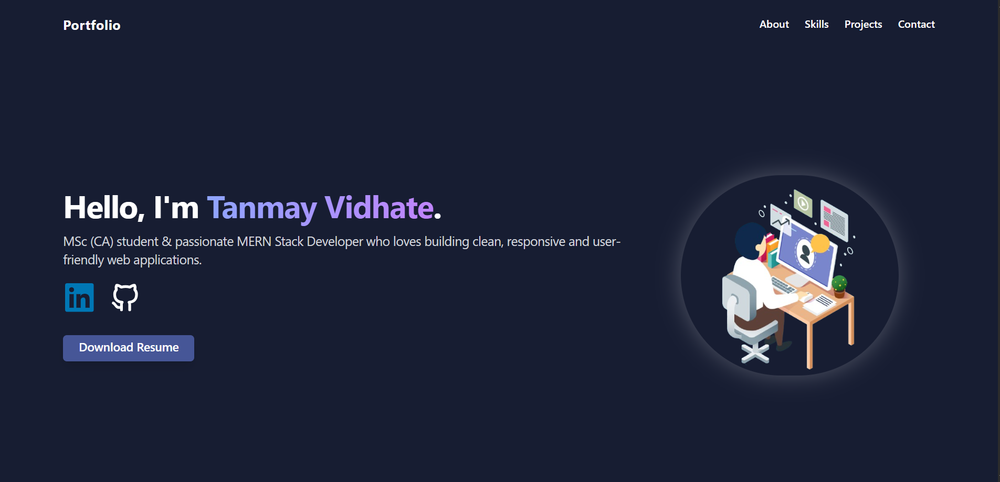
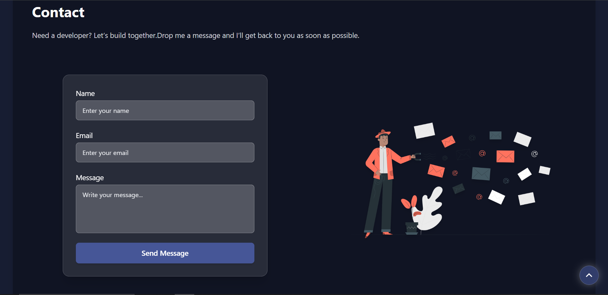
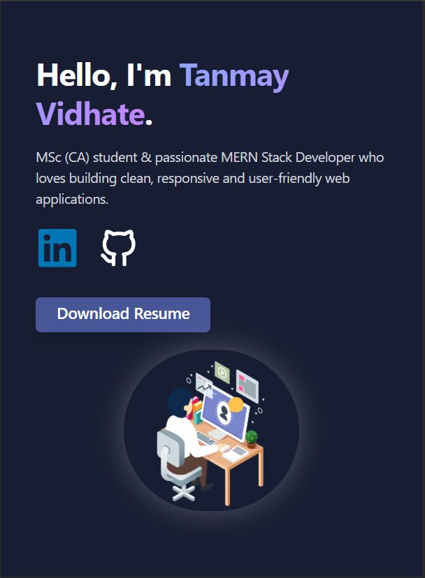
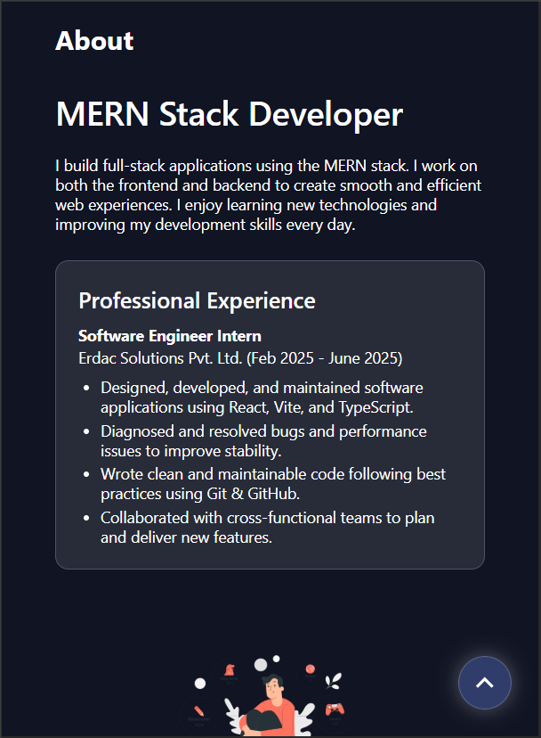
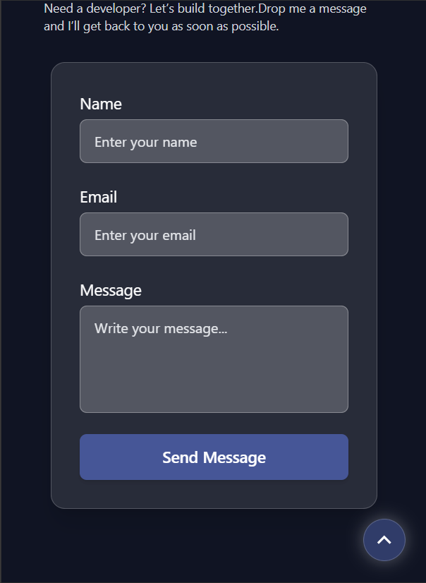

# Personal Portfolio Website

A clean and modern personal portfolio website built using **React** and **TailwindCSS**.  
This website showcases my projects, skills, experience, and provides a way to connect with me.

---

## 🚀 Features

- Responsive and mobile-friendly design  
- Modern UI with smooth animations  
- Projects showcase section  
- About me and skills section  
- Contact form with email support  
- Fast and optimized using React + TailwindCSS  

---

## 🛠️ Tech Stack

- **React JS**  
- **Vite**  
- **TailwindCSS**  
- **EmailJS** (for contact form)  
- **JavaScript / JSX**

---

## 📸 Screenshots

